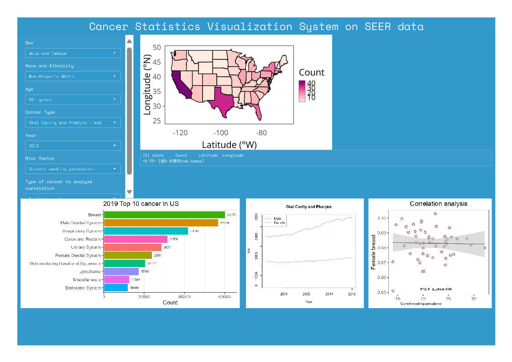

# SEER_Visualization
This is a demo for an R-based visualization UI of SEER data from 2000-2019.

## Requirement
```
* R==4.4.1
* map
* mapproj
* ggplot2
* bslib
* ploty
```

## Run the demo
Install the corresponding version of R in the environment, open the `app.R` script with **Rstudio**, and then install all required packages. Click `Run App` on the top panel above the coding section to run the demo on local. Or run the following command in Linux system:

```Bash
R app.R
```


